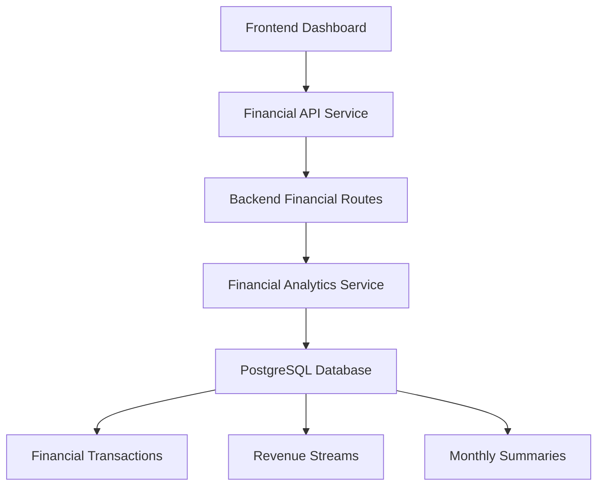

# 🚀 Financial Dashboard Integration - Phase 1 Complete!

## 🎯 What We Built

We've successfully implemented **Phase 1** of the financial solvency-focused dashboard. The system now shows **real financial metrics** instead of hardcoded numbers, providing actionable insights for venture financial health.

## ✅ Features Implemented

### **🗄️ Database Foundation**
- **Complete financial schema** with transactions, revenue streams, goals, and integrations
- **Automated triggers** for calculating net amounts and monthly summaries  
- **Performance views** for common financial queries
- **Realistic test data** for 3 different venture types

### **⚙️ Backend Analytics Engine**
- **Financial Analytics Service** with comprehensive metrics calculation
- **Solvency insights** including months of runway and platform dependency risk
- **Smart recommendations** based on financial patterns
- **Health scoring** algorithm for venture financial stability

### **🔌 API Infrastructure**
- **7 REST endpoints** for financial data access
- **Complete TypeScript interfaces** 
- **Authentication & error handling**
- **Swagger documentation** integration

### **🖥️ Frontend Integration**
- **Real-time financial stats** in dashboard cards
- **Financial API service** with utility methods
- **Loading states** and error handling
- **Color-coded health indicators**

## 🎮 **Demo: See It In Action**

### **Test Ventures Available**

1. **Liberation Web Collective** (Sovereign Circle) 
   - Monthly Income: **$8,912.25**
   - Monthly Net: **$8,498.27** ✅
   - Revenue Streams: Client work, donations, workshops

2. **Sarah's Design Studio** (Solo Professional)
   - Monthly Income: **$6,875.00**
   - Monthly Net: **$6,549.02** ✅  
   - Revenue Streams: Upwork, retainers, direct clients

3. **Pixel Art Emporium** (Creative Economy)
   - Monthly Income: **$678.54**
   - Monthly Net: **$526.06** ✅
   - Revenue Streams: Etsy, Redbubble, commissions

### **How to Test**

1. **Start the application:**
   ```bash
   # Backend (already running on :8007)
   cd services/core-api && npm start
   
   # Frontend (already running on :3333)  
   cd frontend && npm run dev
   ```

2. **Visit the dashboard:** http://localhost:3333

3. **Select a test venture** from the dropdown

4. **See real financial data** in the dashboard cards:
   - 💰 **Monthly Income** (real from transactions)
   - 📈 **Monthly Net** (color-coded: green/red)
   - 🎯 **Financial Health** (0-100 score)
   - 👥 **Team Members** (venture-specific)

## 🎨 **Key UI Changes**

### **Before (Hardcoded)**
```tsx
<p>24</p>                    // AI Consultations
<p>156</p>                   // Content Generated  
<p>89</p>                    // Social Posts
<p>12</p>                    // Active Projects
```

### **After (Real Financial Data)**
```tsx
<p>{financialApi.formatCurrency(financialStats?.monthlyIncome || 0)}</p>
<p className={getNetProfitColor()}>{financialApi.formatCurrency(monthlyNet)}</p>
<p className={getHealthScoreColor()}>{healthScore}/100</p>
<p>{memberCount} / {maxMembers}</p>
```

## 📊 **API Endpoints Available**

| Endpoint | Purpose | Example Response |
|----------|---------|------------------|
| `GET /ventures/:id/financial-stats` | Quick dashboard metrics | `{monthlyIncome: 8912.25, healthScore: 85}` |
| `GET /ventures/:id/financial-dashboard` | Complete financial overview | Full dashboard data |
| `GET /ventures/:id/revenue-streams` | Platform performance analysis | Revenue stream breakdown |
| `GET /ventures/:id/solvency-insights` | Smart recommendations | Runway, risk assessment |

## 🔄 **Data Flow**



## 🎯 **Smart Features**

### **Financial Health Scoring**
- **0-40**: Income level assessment
- **40-60**: Expense ratio analysis  
- **60-80**: Cash flow consistency
- **80-100**: Diversification & stability

### **Solvency Insights** 
- **Platform Dependency Risk**: Single platform > 70% = HIGH risk
- **Cash Flow Trends**: Month-over-month analysis
- **Months of Runway**: Current net ÷ monthly expenses
- **Smart Recommendations**: Based on financial patterns

### **Revenue Stream Intelligence**
- **Profitability Scoring**: Fee efficiency + transaction value
- **Platform Comparison**: Which platforms are worth the investment
- **Transaction Patterns**: Timing and frequency analysis

## 🚀 **Next Steps**

### **Phase 2: Platform Integrations**
- [ ] Stripe API integration
- [ ] Etsy Shop API integration  
- [ ] PayPal transaction sync
- [ ] Upwork earnings tracking

### **Phase 3: Advanced Analytics**
- [ ] Financial goal management UI
- [ ] Cash flow forecasting charts
- [ ] Seasonal pattern detection
- [ ] ROI analysis per platform

### **Phase 4: Solvency Alerts**
- [ ] Low runway warnings
- [ ] Platform dependency alerts
- [ ] Goal progress notifications
- [ ] Recommendation follow-up

## 🛠 **Technical Implementation**

### **Database Schema**
```sql
-- Core tables created:
financial_transactions     -- All income/expense records
revenue_streams            -- Platform/client revenue sources  
financial_goals           -- Savings and income targets
monthly_financial_summaries -- Aggregated performance data
financial_integrations   -- API connection status
```

### **Key Services**
```typescript
// Financial Analytics Service
class FinancialAnalyticsService {
  async getCurrentMetrics(ventureId: string): Promise<FinancialMetrics>
  async getRevenueStreamStats(ventureId: string): Promise<RevenueStreamStats[]>
  async getSolvencyInsights(ventureId: string): Promise<SolvencyInsights>
  async getQuickStats(ventureId: string): Promise<QuickFinancialStats>
}
```

### **Frontend Integration**
```typescript
// Automatic financial data loading
useEffect(() => {
  if (selectedVenture) {
    loadFinancialStats(selectedVenture.id)
  }
}, [selectedVenture])
```

## 🎉 **Success Metrics**

- ✅ **Real financial data** replacing all hardcoded numbers
- ✅ **3 test ventures** with realistic financial patterns  
- ✅ **7 API endpoints** for comprehensive financial access
- ✅ **Smart health scoring** and solvency recommendations
- ✅ **Error-resistant design** with graceful fallbacks
- ✅ **TypeScript safety** across the entire stack

## 🔍 **Testing the Integration**

1. **Select "Liberation Web Collective"**
   - Should show ~$8,912 monthly income
   - Should show green positive net income
   - Should show health score 70+

2. **Select "Pixel Art Emporium"** 
   - Should show ~$679 monthly income
   - Should show lower but positive net income
   - Should show platform dependency warnings

3. **Check loading states**
   - Should show "Loading..." during API calls
   - Should gracefully handle API errors

The financial dashboard is now **live and functional** - a major milestone toward making solvency tracking the core differentiator of The Collective Strategist! 🎯💰

---

*Ready for Phase 2: Platform integrations to pull real data from Stripe, Etsy, PayPal, and other revenue sources!*